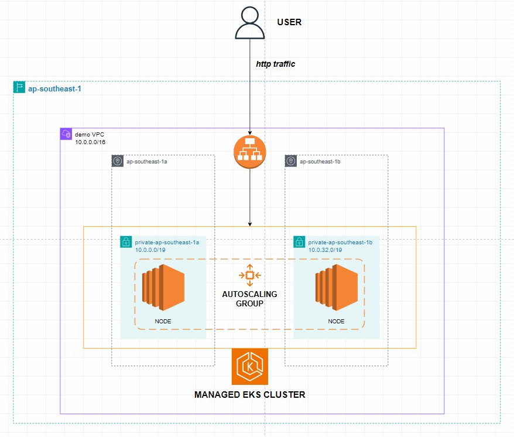

# EKS CI/CD Pipeline for Microservice Application

Welcome to the EKS CI/CD pipeline project! This repository contains the code and configurations necessary to deploy a microservice application on an AWS EKS cluster using a continuous integration and continuous deployment (CI/CD) pipeline.

## Table of Contents

- [Introduction](#introduction)
- [Architecture](#architecture)
- [Prerequisites](#prerequisites)
- [Setup Instructions](#setup-instructions)
- [CI/CD Pipeline](#cicd-pipeline)
- [Technologies Used](#technologies-used)
- [Contributing](#contributing)
- [Reference](#reference)
- [License](#license)

## Introduction

This project demonstrates the automation of deploying a microservice application onto an AWS EKS cluster using a CI/CD pipeline. The pipeline automates building, testing, and deploying the application, ensuring quick and reliable updates.

## Architecture

The architecture of this project includes the following components:

- **Microservice Application**: A sample microservice application written in [your programming language].
- **Docker**: Containerizes the microservice application.
- **AWS EKS (Elastic Kubernetes Service)**: Hosts the containerized application.
- **CI/CD Pipeline**: Automates the build, test, and deploy process using Jenkins.



## Prerequisites

Before you begin, ensure you have the following:

- An AWS account with permissions to create EKS clusters.
- [kubectl](https://kubernetes.io/docs/tasks/tools/install-kubectl/) installed and configured.
- [AWS CLI](https://aws.amazon.com/cli/) installed and configured.
- [Docker](https://www.docker.com/) installed.
- [Jenkins](https://www.jenkins.io/) installed and configured with necessary plugins.

## Setup Instructions

1. **Clone the Repository**:
    ```sh
    git clone https://github.com/dinhcam89/eks_cicd.git
    cd eks_cicd
    ```

2. **AWS EKS Cluster Setup**:
    - Create an EKS cluster using the AWS Management Console or the AWS CLI.
    - Configure `kubectl` to use the newly created EKS cluster:
        ```sh
        aws eks --region <region> update-kubeconfig --name <cluster_name>
        ```

3. **Build Docker Image**:
    - Build and push the Docker image to your container registry:
        ```sh
        docker build -t <your_dockerhub_username>/<your_image_name>:latest .
        docker push <your_dockerhub_username>/<your_image_name>:latest
        ```

4. **Update Kubernetes Manifests**:
    - Update the Kubernetes deployment manifest with your Docker image:
        ```yaml
        containers:
          - name: your-microservice
            image: <your_dockerhub_username>/<your_image_name>:latest
        ```

5. **Apply Kubernetes Manifests**:
    - Deploy the application to the EKS cluster:
        ```sh
        kubectl apply -f k8s/
        ```
## Reference
This project uses the source code from the microservice project found at [Microservice GitHub Repository](https://github.com/aws-containers/retail-store-sample-app). 

## CI/CD Pipeline

The CI/CD pipeline is implemented using Jenkins. It includes the following steps:

1. **Checkout Code**: Retrieve the latest code from the repository.
2. **Build Docker Image**: Build the Docker image of the microservice.
3. **Push Docker Image**: Push the Docker image to Docker Hub.
4. **Deploy to EKS**: Apply Kubernetes manifests to deploy the updated application.

### Jenkins Pipeline Configuration

Here's an example of the Jenkins pipeline configuration (`Jenkinsfile`):

```groovy
pipeline {
    agent any

    environment {
        DOCKERHUB_CREDENTIALS = credentials('dockerhub-credentials')
        KUBECONFIG_CREDENTIALS = credentials('kubeconfig')
    }

    stages {
        stage('Checkout Code') {
            steps {
                checkout scm
            }
        }
        stage('Build Docker Image') {
            steps {
                script {
                    dockerImage = docker.build("${DOCKERHUB_CREDENTIALS_USR}/${JOB_NAME}:${BUILD_ID}")
                }
            }
        }
        stage('Push Docker Image') {
            steps {
                script {
                    docker.withRegistry('https://index.docker.io/v1/', 'dockerhub-credentials') {
                        dockerImage.push()
                    }
                }
            }
        }
        stage('Deploy to EKS') {
            steps {
                withCredentials([file(credentialsId: 'kubeconfig', variable: 'KUBECONFIG')]) {
                    sh 'kubectl set image deployment/your-deployment your-container=${DOCKERHUB_CREDENTIALS_USR}/${JOB_NAME}:${BUILD_ID}'
                    sh 'kubectl rollout status deployment/your-deployment'
                }
            }
        }
    }
}


